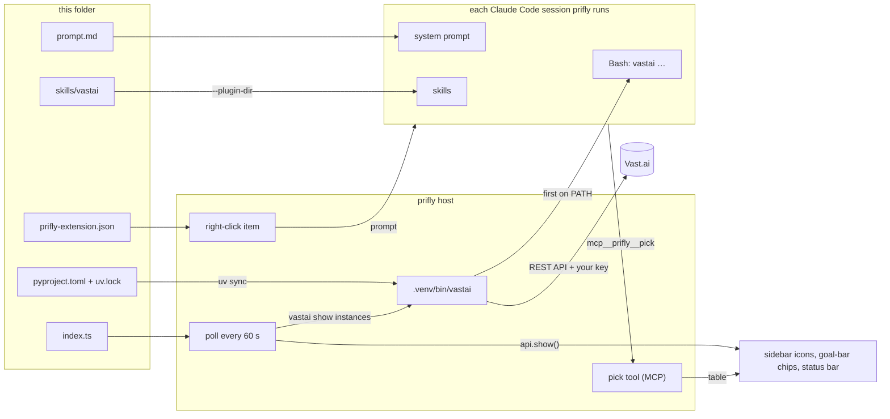

# prifly-ext-vastai

A [prifly](https://github.com/jimmy927/prifly) extension for
[Vast.ai](https://vast.ai). It does three things:

- **Shows your boxes.** Each rented Vast.ai box appears on the session that
  rented it: as an icon on that session's row in the sidebar, and as a chip
  under the goal when the session is open. The colour shows how busy the box
  is. Boxes that no session claims appear in the status bar.
- **Opens a shell on a box.** Click a box's icon and prifly opens `ssh` to it
  in a terminal window of its own: a real desktop window you can move
  anywhere, apart from prifly's. No terminal app is needed.
- **Destroys a box.** Right-click a box's icon, choose **Destroy box…**, and
  confirm.
- **Rents boxes.** Right-click a session and choose **Rent a Vast.ai
  machine…**. Describe what you need, then pick one of ten offers from a
  table.
- **Teaches sessions the rules.** Every session prifly runs learns how to rent
  without surprise bills and how to label what it rents.

Everything it needs comes with it: the `vastai` CLI, the Python that runs the
CLI, the skill and the instructions. Your only step is storing a Vast.ai API
key.

It is also the example to copy when you write an extension of your own. It
uses every part prifly lets an extension plug in except `bin`, all described
under [What an extension can plug in](#what-an-extension-can-plug-in).

## Install

1. In prifly, open **Extensions** in the status bar. Find **Vast.ai boxes**,
   install it, then tick it to enable it. Or clone this repository into
   `~/.local/share/prifly/extensions/` yourself.
2. Store your API key once. Run this in any prifly session, or ask the session
   to do it:

       vastai set api-key <key>

   The CLI keeps the key in `~/.config/vastai/vast_api_key`. Neither prifly
   nor this extension reads it; only the CLI does, and only when it calls
   Vast.ai.
3. Sessions that were already running get the extension's skill,
   instructions and `vastai` when their process next starts. **Apply to idle
   sessions** in the Extensions dialog restarts the ones waiting for you, so
   they get them now.

Nothing is installed outside prifly's own folder, and the machine needs no
Python. See [Python tools](#python-tools-pyprojecttoml-and-uvlock).

## How it works



### Which session owns a box

A box belongs to the session whose id starts its label:

    s-<first 8 characters of the session id>/<name>      e.g.  s-e5636c90/lc-box1

Every Claude Code shell has its session id in `$CLAUDE_CODE_SESSION_ID`, and
prifly also puts the id in the system prompt of each session it runs. That
lets a session label what it rents:

    vastai create instance … --label "s-${CLAUDE_CODE_SESSION_ID:0:8}/lc-box1"
    vastai label instance <id> s-e5636c90/lc-box1      # later, or to hand a box over

The name after the slash is at most 8 characters, so short displays show it
whole. A box with any other label, or none, shows in the status bar marked
`?`. A box nobody watches is still billing someone, so it stays visible.

### The display: `index.ts`

- **Polling.** Once a minute (`refreshSeconds`), the module runs
  `vastai show instances --raw` and reads its JSON.
- **Placing.** Each box becomes one item, placed on the session its label
  names.
- **What an item shows:**
  - its name and hourly rate;
  - a colour: red below 20 % CPU or GPU (paid for and idle), green from 80 %,
    amber in between;
  - red with its status when the box is not running, because a stopped box
    still bills disk;
  - on hover: the instance id, the label, the utilisation, memory and the
    `ssh` command.
- **Clicking.** A running box's item carries a `terminal`: `ssh` to the box as
  root. A click on the icon (in the sidebar, under the goal or in the status
  bar) opens it in a terminal window of prifly's own. See
  [Terminals](#terminals-terminal-on-a-shown-item).
- **Right-clicking.** Every box offers **Destroy box…**. prifly first asks
  (naming the box, its id and its hourly rate). The extension then runs
  `vastai destroy instance <id> -y` and refreshes at once. See
  [Actions](#actions-actions-on-a-shown-item).
- **Failures.** If the CLI fails (offline, no key), the failure is logged as
  `ext.vastai.refresh_failed` in prifly's host log and retried the next
  minute. The extension keeps running.
- **Read-only.** The module only reads. It never rents, stops or destroys
  anything; sessions do that.

### Your ssh key

Vast.ai boxes accept the key your account registered
(`vastai create ssh-key …`), which is usually not one ssh tries by default.
Name it in the installed copy's `config.json`:

```json
{ "sshKey": "~/.ssh/vast_ed25519" }
```

The terminal then runs `ssh -i <key> -o IdentitiesOnly=yes …`. Without it,
ssh uses your defaults and `~/.ssh/config`, and a box that wants another key
answers `Permission denied (publickey)`. The first connection to a box trusts
its host key (`StrictHostKeyChecking=accept-new`), as renting it already did.
A key that changes later is still refused.

### Renting from the right-click menu

**Rent a Vast.ai machine…** is declared in `prifly-extension.json`:

1. prifly asks *"What do you need the machine for?"* in a dialog.
2. It fills your answer into the item's prompt and sends that prompt to the
   session you right-clicked, as if you had typed it.
3. The session has a subagent search the offers with the `vastai` skill and
   pick the ten best fits.
4. The session shows those ten with prifly's `mcp__prifly__pick` tool. The
   table appears in the dialog you are still looking at (and in the
   session's transcript), with a **Rent** button.
5. The session rents the row you chose with `--cancel-unavail`, labels it
   with its own id, and tells you how to reach it. If you choose none, it
   asks what to change and searches again.

### Renting from a chat

Ask any session prifly runs to rent a box. `prompt.md` tells it to offer the
candidates through the same pick tool instead of printing a table and asking
for a number. The table then appears in the chat, where you answer it the
same way you answer a question form.

### The skill: `skills/vastai`

`skills/vastai/SKILL.md` holds the general rules, numbered VAI-1 onward:
- checking your credit before renting several boxes;
- registering an ssh key before renting;
- always using `--cancel-unavail`, and cleaning up after a failed create;
- labelling;
- destroying what you no longer need.

Claude Code loads the skill when a task calls for it. prifly passes this
folder to its sessions with `--plugin-dir`, so the skill appears as
`vastai:vastai`.

**Your own rules.** Put personal rules (your budget, your ssh key, your usual
image) in `skills/vastai-local/SKILL.md`. `skills/*-local/` is gitignored, so
your rules live only in your installed copy, and a `git pull` of this
repository leaves them alone.

### Terminal sessions

prifly only affects the sessions it runs. The repository is also a Claude Code
plugin and its own marketplace, so a terminal session can have the skill too:

    claude plugin marketplace add jimmy927/prifly-ext-vastai
    claude plugin install vastai@prifly-ext-vastai

A terminal session needs its own `vastai` (`uv tool install vastai`). The pick
table and the instructions exist only inside prifly. If Claude Code already
has the plugin installed, prifly does not pass it again, so it never loads
twice.

## What an extension can plug in

An extension is a folder with a `prifly-extension.json` manifest. Beyond its
`id`, `name` and `main`, every part is optional; use the ones your idea needs.
This extension uses all of them except `bin`:

| Part | Declared by | Reaches | When it takes effect |
|---|---|---|---|
| Code in the host | `main` | prifly's host process | when you enable the extension, and each time the host starts |
| Items on sessions and in the status bar | `api.show()` from `main` | the sidebar, the goal bar, the status bar | as soon as you call it |
| Right-click menu items | `menu` | the session you right-clicked | on click |
| Terminals | `terminal` on an item from `api.show()` | a desktop window of its own | when the item is clicked |
| Actions | `actions` on an item, carried out by `api.onAction` | the item's right-click menu | when the reader chooses one |
| System-prompt text | `prompt` | every session prifly runs | when a session's process starts |
| Skills, agents, commands, hooks, MCP servers | `.claude-plugin/plugin.json` | every session prifly runs, via `--plugin-dir` | when a session's process starts |
| Programs on the PATH | `bin`, and `pyproject.toml` | every session prifly runs, and your `main` | when a session's process starts |
| Python tools | `pyproject.toml` + `uv.lock` | a `.venv` prifly builds for you | before your `main` starts |
| Pick tables | the `mcp__prifly__pick` tool (built into prifly) | any session prifly runs | whenever a session calls it |

"When a session's process starts" means a new session, a resumed one, or
**Apply to idle sessions**. A running process keeps what it started with.

### The manifest: `prifly-extension.json`

```json
{
  "id": "vastai",
  "name": "Vast.ai boxes",
  "description": "One line for the Extensions dialog.",
  "version": "0.4.0",
  "main": "index.ts",
  "prompt": "prompt.md",
  "bin": "bin",
  "menu": [
    {
      "id": "rent",
      "label": "Rent a Vast.ai machine…",
      "icon": "server",
      "input": { "title": "What do you need the machine for?", "placeholder": "e.g. …" },
      "prompt": "Rent a Vast.ai machine for this request: {input} … label it s-{session8}/<name> …"
    }
  ]
}
```

| Field | Required | Meaning |
|---|---|---|
| `id` | yes | Lowercase letters, digits and `-`. Settings, logs and menu items are keyed by it. |
| `name` | yes | What the Extensions dialog calls it. |
| `main` | yes | The module prifly imports (TypeScript or JavaScript; prifly runs on Bun). |
| `description`, `version` | no | Shown in the Extensions dialog. |
| `prompt` | no | A Markdown file whose text is added to every session's system prompt, after prifly's own note. |
| `bin` | no | A folder of your own programs (scripts, binaries) to put on the sessions' PATH. |
| `menu` | no | Right-click items; see below. |

### Code in the host: `main`

The module exports `activate(api)`. It may return a function, which prifly
calls when the extension is disabled or the host stops. `prifly-api.ts` in
this repository is the whole contract. Copy it into your own extension so it
type-checks on its own.

| `api.` | What it does |
|---|---|
| `show(bySession, unclaimed)` | Replaces everything this extension shows. `bySession` is keyed by a session id, or any unique start of one (8 characters is enough). Items for an id that matches no session, and the `unclaimed` items, go to the status bar. |
| `sessions()` | The sessions the host knows: id, title, folder and state. Use it to match your things against them. |
| `log(event, fields)` | A line in the host's log, as `ext.<id>.<event>`. |
| `folder` | Your extension's folder: keep your config here (`config.json` is gitignored in this repository). |
| `onAction(handler)` | Carries out the actions your items offer: `handler(key, actionId)` returns what to tell the reader, or throws to report a failure. |
| `paths` | The folders your programs are in: your `bin` and your venv's `bin`. Look your tools up here, for example `Bun.which("vastai", { PATH: api.paths.join(":") })`. |

Each item you show is `{ key, icon, label, tone, details }`:

- **`key`** is stable within your extension, so an item keeps its place in the
  display.
- **`icon`** is one of `server`, `cpu`, `gpu`, `hard-drive`, `cloud`, `box`,
  `zap`, `activity`, `dollar`, `clock`, `alert`, `check`, `link`, `dot`.
- **`label`** is a few words.
- **`tone`** is one of `good`, `warning`, `critical`, `info`, `muted`.
- **`details`** are lines shown on hover.
- **`terminal`** (optional) is `{ title, command }`: what a click on the item
  opens. See [Terminals](#terminals-terminal-on-a-shown-item).
- **`actions`** (optional) are its right-click menu. See
  [Actions](#actions-actions-on-a-shown-item).

An item that fails validation is dropped, and the rest are still shown.

### Terminals: `terminal` on a shown item

Give an item a `terminal` and a click on it opens `command` in a terminal
window of prifly's own. It is a real desktop window, separate from prifly's:
move it to another screen, resize it, close it. The
host runs the program in a real pseudo-terminal (Bun's PTY), so everything a
terminal program expects works: ssh's prompts, colours, `top`, `vim`, `tmux`,
and resizing. The window draws it with [xterm.js](https://xtermjs.org), the
emulator VS Code uses.

```ts
{
  key: "52099850", icon: "server", label: "lc-box1 $0.42/h", tone: "good", details: [],
  terminal: {
    title: "lc-box1 — ssh",
    command: ["ssh", "-i", key, "-p", "19850", "root@ssh7.vast.ai"],
  },
}
```

- **How the command runs.** `command` runs without a shell (the first element
  is the program), as your user, with `TERM=xterm-256color`.
- **The window never sends a command.** It names only the extension and the
  item's `key`, and the host runs what that item says at the moment of the
  click. A page that reached prifly's socket still could not run anything
  else.
- **One window per terminal.** The terminal window opens the program over a
  connection of its own, so the program lives exactly as long as the window.
  Closing it hangs the program up (SIGHUP), as closing a terminal does. When
  the program ends (ssh dropped, `exit`), the window keeps its last screen and
  offers **Run again**.

### Actions: `actions` on a shown item

An item's `actions` are its right-click menu. Each action has an `id`, a
`label` ("Destroy box…"), and optionally a `confirm` text and a `destructive`
flag:

```ts
actions: [{
  id: "destroy",
  label: "Destroy box…",
  confirm: "Destroy lc-box1 (Vast.ai #52099850, $0.42/h)? … This cannot be undone.",
  destructive: true,
}]
```

Your module carries them out:

```ts
api.onAction(async (key, action) => {
  if (action !== "destroy") throw new Error(`Unknown action ${action}`);
  await run(["vastai", "destroy", "instance", key, "-y"]);
  return `Destroyed Vast.ai box #${key}; it no longer bills.`;
});
```

- **Confirming.** With a `confirm` text, prifly asks the reader first; a
  `destructive` action gets a red button. Without one, the action runs on
  selection.
- **Reporting.** What the handler returns is shown to the reader as a notice.
  What it throws is shown as the failure.
- **Only what is offered.** As with terminals, the window names only the
  extension, the item's key and the action's id. prifly runs the action only
  if the item, as your extension shows it at that moment, offers it.

### Right-click menu items: `menu`

Each item has an `id`, a `label` and an `icon` (from the list above), plus a
`prompt` that prifly sends to the right-clicked session. prifly fills in these
placeholders first:

- `{input}`: what the reader typed. Give the item an `input` with a `title`
  and a `placeholder`, and prifly asks for it in a dialog. Without `input`,
  the prompt is sent at once.
- `{sessionId}`: the session's full id.
- `{session8}`: its first 8 characters.

Items appear only on sessions prifly runs, because only those can take a
prompt. After you send, the dialog stays open. If the session then calls the
pick tool, the table appears in that dialog.

### Instructions: `prompt`

The text is added to the system prompt of every session prifly runs, joined
after prifly's own note. Keep it short and always relevant; it costs context
in every session. Put the details in a skill, which Claude Code only loads
when a task calls for it.

### Claude Code plugins: `.claude-plugin/plugin.json`

If the folder is also a Claude Code plugin, prifly passes it to its sessions
with `--plugin-dir`. Anything a plugin can carry then reaches them: `skills/`,
`agents/`, `commands/`, `hooks/`, and MCP servers in `.mcp.json`. Plugin
skills are namespaced, so this one is `vastai:vastai`.

Add `.claude-plugin/marketplace.json` as well and the repository installs in
plain Claude Code too, as it does here.

### Python tools: `pyproject.toml` and `uv.lock`

An extension that needs Python tools ships only the project file and its
lock. It ships no interpreter and no setup script. This one pins the CLI:

```toml
[project]
name = "prifly-ext-vastai-tools"
version = "0.4.0"
requires-python = "==3.12.*"
dependencies = ["vastai==1.6.0"]

[tool.uv]
package = false
```

Create or refresh the lock with `uv lock` after you change the dependencies.

prifly provides the rest, before your `main` starts:

1. **uv.** On first need, prifly downloads its own pinned
   [uv](https://docs.astral.sh/uv/) into `~/.local/share/prifly/tools/uv`. It
   edits no shell profile and does not use a uv you may have installed.
2. **Python.** uv downloads the Python your project asks for into
   `~/.local/share/prifly/tools/python`. Every extension that asks for the
   same version shares that one copy. The machine's own Python, if any, is
   never used.
3. **The venv.** prifly runs `uv sync --frozen` in your folder, which builds
   `.venv` exactly as the lock says. On the next start the venv is already up
   to date, and the sync takes about half a second.
4. **The PATH.** The venv's `bin` goes first on the PATH of every session
   prifly runs, and into `api.paths`.

A `vastai` session runs is therefore this extension's own copy: version
1.6.0, whatever else the machine has. If the sync fails (for example, no
network on the very first start), the extension is stopped, and the error is
shown next to it in the Extensions dialog. Untick and tick it to retry.

Measured on the first start: downloading uv and Python and building this
venv took 6.5 s. On disk, prifly's uv takes 54 MB and the shared Python
106 MB. uv's download cache (142 MB) is shared too.

### The pick tool: `mcp__prifly__pick`

This part is built into prifly, not declared by an extension. prifly gives
every session it runs a small MCP server with one tool, `pick`. Use it when a
choice has more options than a question form holds (four), or when each
option is a row of numbers:

| Argument | Meaning |
|---|---|
| `title` | What is being chosen, in one line. |
| `columns` | The column headings. |
| `rows` | One row per option, cells in column order (at most 50). |
| `action` | The button's word, e.g. `Rent` (default `Choose`). |

The call waits, for up to an hour, until the reader picks. It returns
`The user chose row 3: GPU: RTX 4090, $/h: 0.41, …` or `The user chose none
of the rows.`. The table appears in the session's transcript, and in the
right-click dialog when a menu item started the work.

To use it, tell sessions when to call it: in your `prompt`, your menu item's
prompt, or your skill.

## Safety

- **Your code runs in the host.** An extension's `main` runs inside prifly's
  host with your user's rights, and its skills and instructions steer every
  session. That is why prifly starts no extension until you enable it.
  Enable only extensions you would run yourself.
- **One extension's failure is contained.** If an extension throws while
  loading, starting or showing, it is stopped and its error is shown in the
  Extensions dialog. The host and the other extensions go on.
- **Keep secrets out of the extension.** This extension never touches your
  Vast.ai key. The CLI reads it from `~/.config/vastai/`. Consider
  `chmod 600 ~/.config/vastai/vast_api_key`.

## Files in this repository

| File | Part |
|---|---|
| `prifly-extension.json` | The manifest: id, name, `main`, `prompt`, the menu item |
| `index.ts` | The display: polls `vastai`, shows boxes on sessions |
| `prifly-api.ts` | A copy of prifly's extension contract |
| `prompt.md` | Instructions added to every session prifly runs |
| `skills/vastai/SKILL.md` | The Claude Code skill: renting, labelling, cleanup |
| `.claude-plugin/plugin.json`, `marketplace.json` | Makes the folder a Claude Code plugin, and installable without prifly |
| `pyproject.toml`, `uv.lock` | Pins the `vastai` CLI; prifly builds the `.venv` from them |
| `config.example.json` | Optional settings: `sshKey` for the terminal, `refreshSeconds`, and `vastai` to use another CLI |
