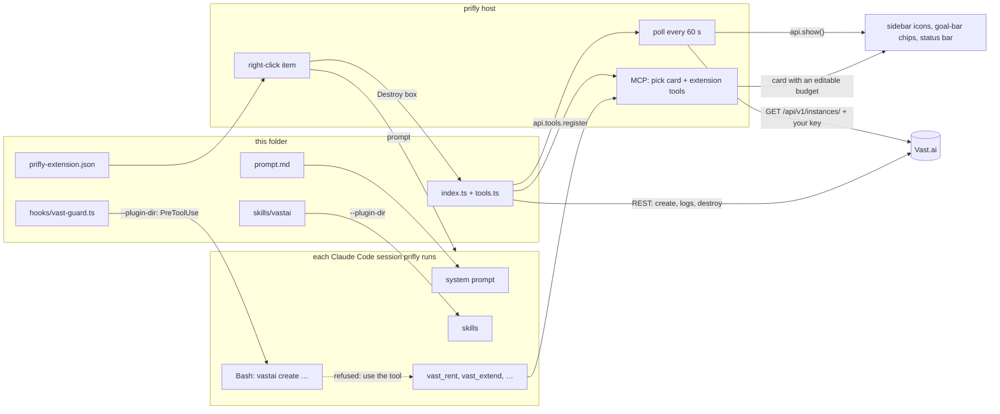

# prifly-ext-vastai

A [prifly](https://github.com/jimmy927/prifly) extension for
[Vast.ai](https://vast.ai). It does these things:

- **Shows your boxes.** Each rented Vast.ai box appears on the session that
  rented it: as an icon on that session's row in the sidebar, and as a chip
  under the goal when the session is open. The colour shows how busy the box
  is. Boxes that no session claims appear in the status bar.
- **Opens a shell on a box.** Click a box's icon and prifly opens `ssh` to it
  in a terminal window of its own: a real desktop window you can move
  anywhere, apart from prifly's. No terminal app is needed.
- **Destroys a box.** Right-click a box's icon, choose **Destroy box…**, and
  confirm.
- **Rents boxes, under a budget you set.** Sessions rent, extend, cancel and
  inspect boxes only through six tools this extension serves
  (`vast_offers`, `vast_rent`, `vast_boxes`, `vast_logs`, `vast_extend`,
  `vast_cancel`). `vast_rent` shows the offers on a card with an editable
  budget; nothing is rented until you click **Rent**, and the amount you
  confirm is the box's hard limit. Right-click a session and choose **Rent a
  Vast.ai machine…** to start one.
- **Refuses the CLI.** A hook in the plugin refuses `vastai create`,
  `destroy`, `label` and the other writing commands, `vastlease`, and
  `curl -X PUT|POST|DELETE` to console.vast.ai, and names the tool to use.
- **Teaches sessions the rules.** Every session prifly runs learns how to rent
  without surprise bills.
- **Shows where the money went.** **Vast.ai spend** in the status bar opens a
  panel. It has three parts:
  - What the account spent per day or week, stacked by session or repository.
    The amounts are Vast.ai's own charges, fetched one UTC day at a time and
    kept in `charges.json`.
  - Who spent it, sorted by dollars, one segment per box.
  - A timeline of every box: when it started, each extension of its lease,
    the lease's end, and how it ended. This comes from the boxes' history in
    `events.jsonl`. On first run, the history is seeded from what prifly's log
    still holds, so it starts about two days back.

Everything it needs comes with it: the tools, the hook, the skill and the
instructions. There is no CLI and no Python. Your only step is storing a
Vast.ai API key.

It is also the example to copy when you write an extension of your own. It
uses nearly every part prifly lets an extension plug in, all described under
[What an extension can plug in](#what-an-extension-can-plug-in).

## Install

1. In prifly, open **Extensions** in the status bar. Find **Vast.ai boxes**,
   install it, then tick it to enable it. Or clone this repository into
   `~/.local/share/prifly/extensions/` yourself.
2. Store your API key once (it is on the account page of the Vast.ai
   console). Best in prifly's vault: open **Vault**, add an entry named
   `vastai` of kind **API token** at **level 1**, and paste the key as its
   token. The manifest names `vastai` under `vault`, so prifly hands this
   extension that one entry's token (`api.vault.read`) and no other. At level
   2, 3 or 4 prifly does not hand it over — those ask you on a session's card,
   which an extension has none of — and the extension falls back to the files
   below. Without a vault entry, or on a prifly too old to have a vault for
   extensions, store it where the Vast.ai CLI keeps it:

       mkdir -p ~/.config/vastai
       printf %s '<key>' > ~/.config/vastai/vast_api_key && chmod 600 ~/.config/vastai/vast_api_key

   `$VAST_API_KEY` works too. The extension reads the key each time it calls
   Vast.ai, the vault entry first, then these; sessions never print it. A key
   saved by `vastai set api-key` on this machine works unchanged. If Vast.ai
   refuses the vault's key, the files' keys are tried next.
3. Sessions that were already running get the extension's tools, hook, skill
   and instructions when their process next starts. **Apply to idle
   sessions** in the Extensions dialog restarts the ones waiting for you, so
   they get them now.

Nothing is installed outside prifly's own folder, and the machine needs
neither the `vastai` CLI nor Python. A prifly older than "extension tools"
still shows the boxes and enforces leases, but serves no tools.

## How it works


```mermaid
flowchart LR
  subgraph ext["this folder"]
    manifest["prifly-extension.json"]
    index["index.ts + tools.ts"]
    prompt["prompt.md"]
    skill["skills/vastai"]
    hook["hooks/vast-guard.ts"]
  end
  subgraph host["prifly host"]
    poll["poll every 60 s"]
    menu["right-click item"]
    mcp["MCP: pick card + extension tools"]
  end
  subgraph session["each Claude Code session prifly runs"]
    sys["system prompt"]
    skills["skills"]
    tools["vast_rent, vast_extend, …"]
    bash["Bash: vastai create …"]
  end
  index --> poll
  index -- "api.tools.register" --> mcp
  poll -- "GET /api/v1/instances/ + your key" --> vast[("Vast.ai")]
  menu -- "Destroy box" --> index
  index -- "REST: create, logs, destroy" --> vast
  poll -- "api.show()" --> ui["sidebar icons, goal-bar chips, status bar"]
  prompt --> sys
  skill -- "--plugin-dir" --> skills
  tools --> mcp -- "card with an editable budget" --> ui
  hook -- "--plugin-dir: PreToolUse" --> bash
  bash -. "refused: use the tool" .-> tools
  manifest --> menu -- "prompt" --> session
```

### Which session owns a box

A box belongs to the session whose id starts its label, under this prifly's
owner:

    <owner>/s-<first 8 characters of the session id>/<name>   e.g.  jimmy/s-e5636c90/lc-box1

The owner is `"owner"` in `config.json` if set, else `$USER`: lower-cased,
only `[a-z0-9_-]`, at most 16 characters. It is there because a second prifly
on another machine, using the same Vast.ai account, labels its boxes the same
way; without an owner this one would see them as unleased and destroy them.
The extension manages only boxes of its own owner. Another owner's box shows
in the status bar, named `<owner>/<name>`, and is never enforced, destroyed
or guarded.

The tools know the session that calls them (prifly passes its full id) and
read the owner the way the extension does, so `vast_rent` with
`name: "lc-box1"` rents the box with exactly this label, and no session builds
one by hand:

    jimmy/s-e5636c90/lc-box1

The name after the last slash is at most 8 characters, so short displays show
it whole. Every tool acts on the calling session's boxes only. The older label `s-<session8>/<name>`, with no owner, still counts
as this prifly's owner during the change-over. A box with any other label, or
none, shows in the status bar marked `?`. A box nobody watches is still
billing someone, so it stays visible.

### The display: `index.ts`

- **Polling.** Once a minute (`refreshSeconds`), `vast-api.ts` asks Vast.ai's
  REST API for the boxes — the same `GET /api/v1/instances/` the CLI's
  `show instances --raw` sends, with the key from prifly's vault entry
  `vastai`, else the one saved in `~/.config/vastai/vast_api_key`. It used to run the CLI itself; on WSL2 each
  run read 30–48 MB off disk and took about a second of CPU, once a minute,
  to start Python.
- **Placing.** Each box becomes one item, placed on the session its label
  names.
- **What an item shows:**
  - its name and hourly rate;
  - a colour: red below 20 % CPU or GPU (paid for and idle), green from 80 %,
    amber in between;
  - red with its status when the box is not running, because a stopped box
    still bills disk;
  - on hover: the instance id, the label, the utilisation, memory and the
    `ssh` command.
- **Clicking.** A running box's item carries a `terminal`: `ssh` to the box as
  root. A click on the icon (in the sidebar, under the goal or in the status
  bar) opens it in a terminal window of prifly's own. See
  [Terminals](#terminals-terminal-on-a-shown-item).
- **Right-clicking.** Every box offers **Destroy box…**. prifly first asks
  (naming the box, its id and its hourly rate). The extension then sends
  `DELETE /api/v0/instances/<id>/` with your key (the call `guard.sh` makes on
  the box) and refreshes at once. See
  [Actions](#actions-actions-on-a-shown-item).
- **Failures.** If Vast.ai cannot be asked (offline, no key), the failure is logged as
  `ext.vastai.refresh_failed` in prifly's host log and retried the next
  minute. The extension keeps running.
- **Rents nothing by itself.** The display never rents or stops a box;
  sessions do that through the tools, and only after you click **Rent**. It
  destroys only what breaks a lease or a budget, and only with enforcement on
  (see Leases).

### Leases and budgets: `leases.ts`, `spend.ts`, `rules.ts`, `enforce.ts`, `guard.sh`

A session's box (labelled `<owner>/s-<session8>/<name>` with this prifly's
owner, or the older `s-<session8>/<name>`) must hold a lease: how long
the session booked it for. On 2026-09-28 two boxes sat idle for 24 hours
because the session that rented them hit its usage limit, and the only check
on them ran inside that session. A lease runs out on its own, so a stopped
session no longer keeps a box. A lease also carries a **budget**: the dollars
you confirmed on the rental card.

- **Booking.** `vast_rent` books the lease just before it creates the box,
  with the budget you confirmed (not the one the session suggested) and an end
  of 24 hours at most, held to the hour the budget runs out. `vast_extend`
  extends it and `vast_cancel` ends it. Leases are kept in `leases.json` in
  this folder, under a lock. A lease with no `budget` key (written before
  budgets) reads as having none.
- **The budget.** Each minute the extension works out what each box has cost:
  `dph_total` (Vast.ai's hourly rate, disk included) times the hours since the
  box started (`spend.ts`); nothing is stored. At 90 % of the budget you are
  told, once (`api.notify`, naming the session). At 100 % the box is saved and
  destroyed ("budget reached"), even with hours of lease left. Per-GB
  bandwidth charges are not in `dph_total` and not counted. The lease's end is
  held to the hour the budget runs out, so the on-box guard enforces the
  budget when prifly is closed (it waits its usual half hour after that end,
  so offline a box can cost up to half an hour more than its budget).
- **Extending.** `vast_extend <name> <hours>` is free while the box's cost to
  the new end stays within its budget. Past that, the session shows you a
  one-row card with the new budget as an editable amount ("New budget for
  lc-box1", action **Raise budget**); after your click the lease is extended
  as far as the amount you confirm allows.
- **The rules** (once a minute):
  - A box labelled another way is never touched: boxes rented by hand, or by
    other software, have their own clean-up. Nor is a box of another owner.
  - A box whose session this prifly does not know (`api.sessions()`, which
    includes past sessions) is only warned about once, "not this prifly's
    session": never destroyed and never guarded, whatever its lease says.
  - A session's box with no lease is destroyed 5 minutes after it starts.
  - 15 minutes before a lease ends, the reader is told. 15 minutes after it
    ended, the box is saved and destroyed. `vast_cancel` does that at once.
  - Every rental has a host end date (`end_date`), when Vast.ai stops the
    box. 30 minutes before it, whatever the lease says, the box is saved
    while it still runs and destroyed. `vast_extend` never reaches past that
    point, and `vast_boxes` shows the end date.
  - An idle box inside its lease is only told about: CPU and GPU under 5 %
    and less than 10 MB of traffic for an hour. Traffic is what separates
    idle from downloading.
- **Saving.** Before destroying, `/root/.lease/save` runs on the box if it
  has one: up to 10 minutes, once more 10 minutes later if it fails, then
  the box is destroyed anyway. The box is destroyed over REST,
  `DELETE /api/v0/instances/<id>/` with your key.
- **When prifly is closed.** Every leased box that is running gets
  `guard.sh` as `/root/.lease/guard.sh`, with the lease's end in
  `/root/.lease/until`, kept current over ssh. Half an hour after the lease
  ended it runs the same save and destroys the box with its own restricted key
  (`CONTAINER_API_KEY`, which Vast.ai gives every box). It logs to
  `/root/.lease/guard.log`.
- **The chip** shows the time left and, when the lease has a budget, what the
  box has cost of it ("$7.40 of $20"); it turns amber near the end of either
  and red past it. Its menu has "Extend lease by 1 hour" and "Extend lease by
  4 hours". On a box with no lease, these give it one: that is how the reader
  keeps a box.
- **Enforcement is off until you turn it on.** Set `"enforce": true` in
  `config.json`. Until then nothing is destroyed and no guard is installed;
  the extension only says "Would destroy lc-box3 (no lease)". Notices go
  through prifly's `api.notify`, and only to the log on a prifly without it.

### The account's credit: `credit.ts`

Every box on the Vast.ai account draws on one credit: this prifly's boxes,
another prifly's, boxes rented by hand, and serverless endpoints' workers
(labelled `<endpoint>:<endpoint id>:<group id>`). When the credit falls below
the account's `balance_threshold` (about $0), Vast.ai stops all of them at
once. On 3 October 2026 a $60 budget was confirmed against $58.55 of credit
that two serverless endpoints also drew on; the run would have stalled near
its end. The extension now checks every booking against the credit.

- **Reading it.** `GET /api/v0/users/current/` gives `credit` and the
  threshold, read with each minute's box list and by each money card.
- **What is committed.** A running box of this prifly with a budget will cost
  the rest of it (`vast_extend` is free within it). A leased box with no
  budget costs its burn to the lease's end. Every other box, and every
  serverless worker, costs its burn for `horizonHours`: `dph_total` while
  running, `storage_total_cost` (the disk) while stopped. A booking not rented
  yet costs its budget.
- **The margin.** On top of a new budget and what is committed, the larger of
  `marginPercent` of the two and `marginHours` of the account's burn, the new
  box included, is kept free.
- **On the card.** `vast_rent`'s card shows the breakdown under the budget:
  "Vast credit $120.00 − committed $41.30 (jtrain2: $38.20 left of its budget ·
  serverless rj-judge, rj-reranker: $3.10 over 24 h) − margin $16.70 → covers
  a budget up to $62". Past that amount the field turns amber, a warning says
  what happens at $0, and **Rent** waits until you tick "Rent anyway: I will
  top up before the credit runs out". The session is then told when the
  credit runs out, to remind you. **Raise budget** on `vast_extend` does the
  same, counting what the box has spent already. The limit needs a prifly
  whose `api.features` include `pick-amount-limit`. On an older one, the
  breakdown goes in the hint, and a budget past it is asked about again on a
  second card.
- **While boxes run.** Each minute the runway (the credit ÷ the account's
  burn) is checked. Under each of `warnHours` you are told once, on the
  sessions whose boxes bill, or in the status bar when none of this prifly's
  do. A box whose budget runs on past the point the credit runs out is told to
  its session, once per budget. The extension only warns: Vast.ai's own
  auto-stop still acts at the threshold. The Vast.ai provider card shows the
  credit, burn and runway, amber or red under the warnings.
- **Topping up.** Vast.ai has no API that adds credit: top up at
  console.vast.ai → Billing, or turn on its auto-billing there. The next
  minute's read sees the credit rise, says so if you were warned, and lets
  the warnings come again.
- **If Vast.ai does not answer**, the card says "Vast credit unknown" and holds
  nothing back.

Settings, in `config.json` (these are the defaults):

```json
{ "credit": { "marginPercent": 10, "marginHours": 3, "horizonHours": 24, "warnHours": [12, 3, 1] } }
```

### Your ssh key

Vast.ai boxes accept the key your account registered (on the console's
account page), which is usually not one ssh tries by default.
Name it in the installed copy's `config.json`:

```json
{ "sshKey": "~/.ssh/vast_ed25519" }
```

The terminal then runs `ssh -i <key> -o IdentitiesOnly=yes …`. Without it,
ssh uses your defaults and `~/.ssh/config`, and a box that wants another key
answers `Permission denied (publickey)`. The first connection to a box trusts
its host key (`StrictHostKeyChecking=accept-new`), as renting it already did.
A key that changes later is still refused.

### Renting from the right-click menu

**Rent a Vast.ai machine…** is declared in `prifly-extension.json`:

1. prifly asks *"What do you need the machine for?"* in a dialog.
2. It fills your answer into the item's prompt and sends that prompt to the
   session you right-clicked, as if you had typed it.
3. The session has a subagent search the offers with `vast_offers` and the
   `vastai` skill, and choose the best few.
4. The session calls `vast_rent` with those offer ids, best first, a name, the
   image and disk, what the box is for, and a **suggested budget**.
5. `vast_rent` looks each offer up again and drops the gone ones and any that
   could not run an hour within the budget. The rest appear on prifly's pick
   card, in the dialog you are still looking at (and in the session's
   transcript), with the budget as an editable field: "Budget for this
   rental", the session's reason under it, and an **Hours** column that
   recomputes as you type. Nothing is booked or created yet.
6. You change the budget if you like and click **Rent**. The lease is booked
   with the amount you confirmed, and the offer is created (`PUT
   /api/v0/asks/<id>/` with `cancel_unavail`). If that offer is gone, the
   next card rows that still fit the confirmed budget are tried in card
   order. If you choose none, or every create fails, the booking is dropped
   and the session is told why.
7. The session tells you which box it is, what it costs per hour, the budget,
   the lease end and how to reach it.

### Renting from a chat

Ask any session prifly runs to rent a box. `prompt.md` tells it to use
`vast_offers` and `vast_rent`; the card then appears in the chat, where you
answer it the same way you answer a question form. A session that tries
`vastai create instance` instead is stopped by the hook, which points it to
`vast_rent`.

### The tools: `tools.ts`, `rent.ts`

`activate` registers them with `api.tools?.register(...)`; a prifly without
that API serves none, and the extension still works as a box display. Each
tool acts on the calling session's boxes only.

| Tool | What it does |
|---|---|
| `vast_offers` | The cheapest rentable GPU machines that pass the filters (GPU name, `min_vram_gb`, `min_cpu_cores`, `min_ram_gb`, `min_disk_gb`, `max_dph`, `min_reliability` default 0.98, `region`, `min_inet_down_mbps`, `min_hours`, `limit` default 10), from the public `GET /api/v0/bundles/`. No key. Returns offer ids. |
| `vast_rent` | `name` (8 characters at most), `budget`, `offers`, `image`, `disk_gb`, `purpose`, optionally `onstart`, `env`, `ports`. Shows the card; books and creates only after the reader's click. |
| `vast_boxes` | The account's credit, burn, runway and committed spend, then this session's boxes: status, $/h, spent of budget, lease end, ssh. |
| `vast_logs` | `name`, `tail`: asks Vast.ai for the box's logs (`PUT /api/v0/instances/request_logs/<id>/`), fetches the returned URL, returns the end. |
| `vast_extend` | `name`, `hours`: free within the budget, otherwise asks the reader to raise it. |
| `vast_cancel` | `name`: ends the lease; the enforcer saves and destroys the box within a minute. |

### The hook: `hooks/`

`hooks/hooks.json` is a plugin hook, found at the plugin's root and run with
`${CLAUDE_PLUGIN_ROOT}` (this repository's root, where `.claude-plugin/`
lives; prifly passes the folder with `--plugin-dir`). It is a `PreToolUse`
hook on `Bash` that runs `bun hooks/vast-guard.ts`, which reads the hook's
JSON from stdin and refuses, with the tool to use in the reason:

- `vastai` or `vast` followed by `create`, `launch`, `destroy`, `label`,
  `stop`, `start`, `reboot`, `recycle`, `update`, `copy` or `execute`, by name
  or by path;
- `vastlease`;
- `curl`, `wget` or `http` with `-X` or `--request` PUT, POST or DELETE
  aimed at console.vast.ai.

It matches only where a command word starts (the `COMMAND_START` and
`WRAPPERS` patterns of prifly's own tool guard), so `grep "vastai create"
docs/` passes and `yes y | /path/vastai destroy instance 1` is refused.
`vastai show instances`, `search offers` and `logs` pass. A variable
(`$V destroy instance 1`) cannot be resolved and passes: the hook stops the
usual shapes, not a determined script, and the API key is still in the
environment of anyone who reads it. It imports nothing, so it runs in a
terminal session that installed the plugin, with no `node_modules`.

### The skill: `skills/vastai`

`skills/vastai/SKILL.md` holds the general rules, numbered VAI-1 onward:
- the one credit every box on the account draws on, and topping it up;
- registering an ssh key before renting;
- suggesting a budget, and what the budget does;
- how the tools label, book and tear down;
- cleaning up after a failed rental;
- choosing offers, and the ssh traps.

Claude Code loads the skill when a task calls for it. prifly passes this
folder to its sessions with `--plugin-dir`, so the skill appears as
`vastai:vastai`.

**Your own rules.** Put personal rules (your budget, your ssh key, your usual
image) in `skills/vastai-local/SKILL.md`. `skills/*-local/` is gitignored, so
your rules live only in your installed copy, and a `git pull` of this
repository leaves them alone.

### Terminal sessions

prifly only affects the sessions it runs. The repository is also a Claude Code
plugin and its own marketplace, so a terminal session can have the skill and
the hook too:

    claude plugin marketplace add jimmy927/prifly-ext-vastai
    claude plugin install vastai@prifly-ext-vastai

The tools, the pick card and the instructions exist only inside prifly, so a
terminal session with the plugin has the skill and a hook that refuses the
CLI's writes, and no way to rent. If Claude Code already has the plugin
installed, prifly does not pass it again, so it never loads twice.

## What an extension can plug in

An extension is a folder with a `prifly-extension.json` manifest. Beyond its
`id`, `name` and `main`, every part is optional; use the ones your idea needs.
This extension uses all of them except `bin` and Python tools:

| Part | Declared by | Reaches | When it takes effect |
|---|---|---|---|
| Code in the host | `main` | prifly's host process | when you enable the extension, and each time the host starts |
| Items on sessions and in the status bar | `api.show()` from `main` | the sidebar, the goal bar, the status bar | as soon as you call it |
| Right-click menu items | `menu` | the session you right-clicked | on click |
| Terminals | `terminal` on an item from `api.show()` | a desktop window of its own | when the item is clicked |
| Actions | `actions` on an item, carried out by `api.onAction` | the item's right-click menu | when the reader chooses one |
| System-prompt text | `prompt` | every session prifly runs | when a session's process starts |
| Skills, agents, commands, hooks, MCP servers | `.claude-plugin/plugin.json` | every session prifly runs, via `--plugin-dir` | when a session's process starts |
| MCP tools | `api.tools.register()` from `main` | every session prifly runs, as `mcp__prifly__<name>` | when you enable the extension |
| Programs on the PATH | `bin`, and `pyproject.toml` | every session prifly runs, and your `main` | when a session's process starts |
| Python tools | `pyproject.toml` + `uv.lock` | a `.venv` prifly builds for you | before your `main` starts |
| Pick tables | the `mcp__prifly__pick` tool, or `ctx.pick` in your own tool | any session prifly runs | whenever a session calls it |

"When a session's process starts" means a new session, a resumed one, or
**Apply to idle sessions**. A running process keeps what it started with.

### The manifest: `prifly-extension.json`

```json
{
  "id": "vastai",
  "name": "Vast.ai boxes",
  "description": "One line for the Extensions dialog.",
  "version": "0.7.0",
  "main": "index.ts",
  "prompt": "prompt.md",
  "menu": [
    {
      "id": "rent",
      "label": "Rent a Vast.ai machine…",
      "icon": "server",
      "input": { "title": "What do you need the machine for?", "placeholder": "e.g. …" },
      "prompt": "Rent a Vast.ai machine for this request: {input} … vast_offers, then vast_rent with a suggested budget …"
    }
  ]
}
```

| Field | Required | Meaning |
|---|---|---|
| `id` | yes | Lowercase letters, digits and `-`. Settings, logs and menu items are keyed by it. |
| `name` | yes | What the Extensions dialog calls it. |
| `main` | yes | The module prifly imports (TypeScript or JavaScript; prifly runs on Bun). |
| `description`, `version` | no | Shown in the Extensions dialog. |
| `prompt` | no | A Markdown file whose text is added to every session's system prompt, after prifly's own note. |
| `bin` | no | A folder of your own programs (scripts, binaries) to put on the sessions' PATH. |
| `menu` | no | Right-click items; see below. |

### Code in the host: `main`

The module exports `activate(api)`. It may return a function, which prifly
calls when the extension is disabled or the host stops. `prifly-api.ts` in
this repository is the whole contract. Copy it into your own extension so it
type-checks on its own.

| `api.` | What it does |
|---|---|
| `show(bySession, unclaimed)` | Replaces everything this extension shows. `bySession` is keyed by a session id, or any unique start of one (8 characters is enough). Items for an id that matches no session, and the `unclaimed` items, go to the status bar. |
| `sessions()` | The sessions the host knows: id, title, folder and state. Use it to match your things against them. |
| `log(event, fields)` | A line in the host's log, as `ext.<id>.<event>`. |
| `folder` | Your extension's folder: keep your config here (`config.json` is gitignored in this repository). |
| `onAction(handler)` | Carries out the actions your items offer: `handler(key, actionId)` returns what to tell the reader, or throws to report a failure. |
| `tools?.register(tools)` | Serves MCP tools to every session. Each tool has a `name`, a `description`, a JSON-schema `inputSchema` and `call(args, ctx)`; `ctx.session` is the caller's full session id, `ctx.pick(card)` shows prifly's pick card (optionally with an editable `amount`) and resolves to `{ row, amount }` or null, and `ctx.signal` aborts when the session goes away. Absent on an older prifly: call it as `api.tools?.register(...)`. |
| `notify?(text, options)` | Tells the reader something now, under the extension's name; `session` makes a click open that session. Absent on an older prifly. |
| `vault?.read(name)` | The token of prifly's vault entry `name`, or null: only an **API token** entry at level 1, and only one your manifest names under `"vault": ["<name>"]`. Read it each time you need it. Absent on an older prifly: call it as `api.vault?.read(...)` and keep a fallback. |
| `paths` | The folders your programs are in: your `bin` and your venv's `bin`. This extension ships neither. |

Each item you show is `{ key, icon, label, tone, details }`:

- **`key`** is stable within your extension, so an item keeps its place in the
  display.
- **`icon`** is one of `server`, `cpu`, `gpu`, `hard-drive`, `cloud`, `box`,
  `zap`, `activity`, `dollar`, `clock`, `alert`, `check`, `link`, `dot`.
- **`label`** is a few words.
- **`tone`** is one of `good`, `warning`, `critical`, `info`, `muted`.
- **`details`** are lines shown on hover.
- **`terminal`** (optional) is `{ title, command }`: what a click on the item
  opens. See [Terminals](#terminals-terminal-on-a-shown-item).
- **`actions`** (optional) are its right-click menu. See
  [Actions](#actions-actions-on-a-shown-item).

An item that fails validation is dropped, and the rest are still shown.

### Terminals: `terminal` on a shown item

Give an item a `terminal` and a click on it opens `command` in a terminal
window of prifly's own. It is a real desktop window, separate from prifly's:
move it to another screen, resize it, close it. The
host runs the program in a real pseudo-terminal (Bun's PTY), so everything a
terminal program expects works: ssh's prompts, colours, `top`, `vim`, `tmux`,
and resizing. The window draws it with [xterm.js](https://xtermjs.org), the
emulator VS Code uses.

```ts
{
  key: "52099850", icon: "server", label: "lc-box1 $0.42/h", tone: "good", details: [],
  terminal: {
    title: "lc-box1 — ssh",
    command: ["ssh", "-i", key, "-p", "19850", "root@ssh7.vast.ai"],
  },
}
```

- **How the command runs.** `command` runs without a shell (the first element
  is the program), as your user, with `TERM=xterm-256color`.
- **The window never sends a command.** It names only the extension and the
  item's `key`, and the host runs what that item says at the moment of the
  click. A page that reached prifly's socket still could not run anything
  else.
- **One window per terminal.** The terminal window opens the program over a
  connection of its own, so the program lives exactly as long as the window.
  Closing it hangs the program up (SIGHUP), as closing a terminal does. When
  the program ends (ssh dropped, `exit`), the window keeps its last screen and
  offers **Run again**.

### Actions: `actions` on a shown item

An item's `actions` are its right-click menu. Each action has an `id`, a
`label` ("Destroy box…"), and optionally a `confirm` text and a `destructive`
flag:

```ts
actions: [{
  id: "destroy",
  label: "Destroy box…",
  confirm: "Destroy lc-box1 (Vast.ai #52099850, $0.42/h)? … This cannot be undone.",
  destructive: true,
}]
```

Your module carries them out:

```ts
api.onAction(async (key, action) => {
  if (action !== "destroy") throw new Error(`Unknown action ${action}`);
  await destroyInstance(apiKey, Number(key));
  return `Destroyed Vast.ai box #${key}; it no longer bills.`;
});
```

- **Confirming.** With a `confirm` text, prifly asks the reader first; a
  `destructive` action gets a red button. Without one, the action runs on
  selection.
- **Reporting.** What the handler returns is shown to the reader as a notice.
  What it throws is shown as the failure.
- **Only what is offered.** As with terminals, the window names only the
  extension, the item's key and the action's id. prifly runs the action only
  if the item, as your extension shows it at that moment, offers it.

### Right-click menu items: `menu`

Each item has an `id`, a `label` and an `icon` (from the list above), plus a
`prompt` that prifly sends to the right-clicked session. prifly fills in these
placeholders first:

- `{input}`: what the reader typed. Give the item an `input` with a `title`
  and a `placeholder`, and prifly asks for it in a dialog. Without `input`,
  the prompt is sent at once.
- `{sessionId}`: the session's full id.
- `{session8}`: its first 8 characters.

Items appear only on sessions prifly runs, because only those can take a
prompt. After you send, the dialog stays open. If the session then calls the
pick tool, the table appears in that dialog.

### Instructions: `prompt`

The text is added to the system prompt of every session prifly runs, joined
after prifly's own note. Keep it short and always relevant; it costs context
in every session. Put the details in a skill, which Claude Code only loads
when a task calls for it.

### Claude Code plugins: `.claude-plugin/plugin.json`

If the folder is also a Claude Code plugin, prifly passes it to its sessions
with `--plugin-dir`. Anything a plugin can carry then reaches them: `skills/`,
`agents/`, `commands/`, `hooks/`, and MCP servers in `.mcp.json`. Plugin
skills are namespaced, so this one is `vastai:vastai`. This one also carries a
hook (`hooks/hooks.json`; see [The hook](#the-hook-hooks)).

Add `.claude-plugin/marketplace.json` as well and the repository installs in
plain Claude Code too, as it does here.

### Python tools: `pyproject.toml` and `uv.lock`

An extension that needs Python tools ships only the project file and its
lock. It ships no interpreter and no setup script. This extension used to pin
the `vastai` CLI this way and no longer needs any (the tools talk to Vast.ai's
REST API directly); an extension that does would ship:

```toml
[project]
name = "prifly-ext-example-tools"
version = "0.1.0"
requires-python = "==3.12.*"
dependencies = ["some-tool==1.2.3"]

[tool.uv]
package = false
```

Create or refresh the lock with `uv lock` after you change the dependencies.

prifly provides the rest, before your `main` starts:

1. **uv.** On first need, prifly downloads its own pinned
   [uv](https://docs.astral.sh/uv/) into `~/.local/share/prifly/tools/uv`. It
   edits no shell profile and does not use a uv you may have installed.
2. **Python.** uv downloads the Python your project asks for into
   `~/.local/share/prifly/tools/python`. Every extension that asks for the
   same version shares that one copy. The machine's own Python, if any, is
   never used.
3. **The venv.** prifly runs `uv sync --frozen` in your folder, which builds
   `.venv` exactly as the lock says. On the next start the venv is already up
   to date, and the sync takes about half a second.
4. **The PATH.** The venv's `bin` goes first on the PATH of every session
   prifly runs, and into `api.paths`.

A tool a session runs is therefore the extension's own copy, whatever else the
machine has. If the sync fails (for example, no
network on the very first start), the extension is stopped, and the error is
shown next to it in the Extensions dialog. Untick and tick it to retry.

Measured on the first start, with the vastai CLI pinned: downloading uv and
Python and building the venv took 6.5 s. On disk, prifly's uv takes 54 MB and the shared Python
106 MB. uv's download cache (142 MB) is shared too.

### The pick tool: `mcp__prifly__pick`

This part is built into prifly, not declared by an extension. prifly gives
every session it runs a small MCP server with one tool, `pick`. Use it when a
choice has more options than a question form holds (four), or when each
option is a row of numbers:

| Argument | Meaning |
|---|---|
| `title` | What is being chosen, in one line. |
| `columns` | The column headings. |
| `rows` | One row per option, cells in column order (at most 50). |
| `action` | The button's word, e.g. `Rent` (default `Choose`). |

The call waits, for up to an hour, until the reader picks. It returns
`The user chose row 3: GPU: RTX 4090, $/h: 0.41, …` or `The user chose none
of the rows.`. The table appears in the session's transcript, and in the
right-click dialog when a menu item started the work.

To use it, tell sessions when to call it: in your `prompt`, your menu item's
prompt, or your skill.

## Safety

- **Your code runs in the host.** An extension's `main` runs inside prifly's
  host with your user's rights, and its skills and instructions steer every
  session. That is why prifly starts no extension until you enable it.
  Enable only extensions you would run yourself.
- **One extension's failure is contained.** If an extension throws while
  loading, starting or showing, it is stopped and its error is shown in the
  Extensions dialog. The host and the other extensions go on.
- **Keep secrets out of the extension.** This extension never touches your
  Vast.ai key. It reads the key from prifly's vault (`api.vault.read`, only
  the `vastai` entry its manifest names, only at level 1), else from
  `~/.config/vastai/` (or `$VAST_API_KEY`), only to call Vast.ai, and neither
  logs nor shows it. prifly's vault audit lists the read as
  "extension vastai". Without the vault, consider
  `chmod 600 ~/.config/vastai/vast_api_key`.
- **A budget is a limit, not a lock.** The hook stops the usual shapes of a
  rental from a shell; a script that reads the key can still rent. The budget
  covers the hourly rate, not per-GB bandwidth charges.

## Files in this repository

| File | Part |
|---|---|
| `prifly-extension.json` | The manifest: id, name, `main`, `prompt`, the menu item |
| `index.ts` | The display: polls Vast.ai, shows boxes on sessions |
| `leases.ts`, `spend.ts`, `rules.ts`, `enforce.ts` | Leases and budgets: the store, what a box has cost, the rules, carrying them out |
| `credit.ts` | The account's credit against what is committed on it: the limit on the money cards, the runway |
| `guard.sh` | The on-box guard that destroys a box whose lease is over while prifly is closed |
| `tools.ts`, `rent.ts`, `tool-kit.ts` | The MCP tools sessions rent, extend, cancel and inspect boxes with |
| `offers.ts` | The public marketplace search and one offer's price, over `GET /api/v0/bundles/` |
| `hooks/hooks.json`, `hooks/vast-guard.ts` | The plugin's `PreToolUse` hook that refuses the CLI's writes |
| `run.ts` | Running commands on a box over ssh |
| `vast-api.ts` | Vast.ai's REST API: the box list (read tolerantly with zod), create, logs, destroy |
| `prifly-api.ts` | A copy of prifly's extension contract |
| `prompt.md` | Instructions added to every session prifly runs |
| `skills/vastai/SKILL.md` | The Claude Code skill: money and budgets, the tools, cleanup, choosing offers, the ssh traps |
| `.claude-plugin/plugin.json`, `marketplace.json` | Makes the folder a Claude Code plugin, and installable without prifly |
| `owner.ts` | The label owner, from `config.json` or `$USER`, for the extension and its tools alike |
| `events.ts`, `timeline.ts` | The boxes' history (`events.jsonl`): rents, extensions, cancels, destroys, boxes appearing and going; folded into the timeline |
| `charges.ts` | What each box cost per UTC day, from `GET /api/v0/charges/`, cached in `charges.json` |
| `spend-panel.ts`, `repo.ts`, `panel/` | The spend panel: its `api/data` answer (groups by session and repository) and its page |
| `config.example.json` | Optional settings: `sshKey` for the terminal and the leases' ssh, `refreshSeconds`, `enforce`, `owner` (else `$USER`), `credit` |
